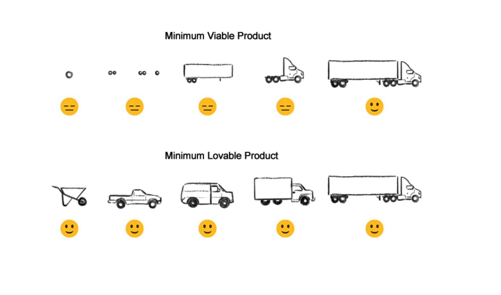

## Welcome to [Whoever Designs](https://whoeverdesigns.github.io/website/)

Brand new small company and lets start off by introducing the idea of the MLP

---

The first lovable product is going to be the [Switchbox](https://github.com/andyle9191/Wire-Less_SwitchBox)

A way of controlling automotive power. 

it's a little computer that can enhance the way that vehicles are wired. 

* it's open. program it to do whatever you want.
* It's durable. Electrically and physically. 
* It's powerful. Control real amounts of power, >5a X16ch
* It's smart. Intergrated sensors, measure voltages, currents, movements, locations, 
* Works on a variety of voltages, 5-23v. You can even power it from a USB PD charger if you want. (Laptop charger)

----

Having trouble with Pages? Check out our [documentation](https://docs.github.com/categories/github-pages-basics/) or [contact support](https://support.github.com/contact) and we’ll help you sort it out.
